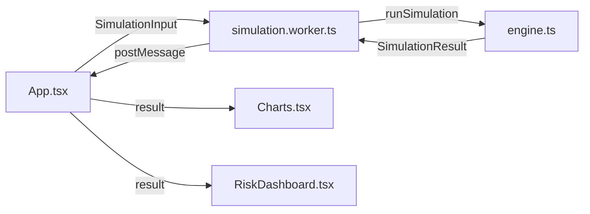

# GEMINI.md

> **Domain Expert Role**: 이 문서는 은퇴 시뮬레이션의 **비즈니스 로직**과 **수학적 모델**을 정의합니다. 코드를 수정할 때 본 문서의 로직을 엄격히 준수해야 합니다.

[🇺🇸 English](README_EN.md) | [📋 개발 가이드](CLAUDE.md)

---

## 1. 시뮬레이션 엔진 로직 (Simulation Physics)

**파일**: `frontend/src/logic/engine.ts`, `frontend/src/logic/engine/context.ts`, `frontend/src/logic/engine/summary.ts`

### 1-1. 자산 성장 모델 (Geometric Brownian Motion)
- **기본 공식**: $S_t = S_{t-1} \times (1 + \mu_{monthly} + \sigma_{monthly} \times Z)$
- **파라미터**:
    - $\mu$ (Expected Return): `PortfolioEditor`에서 설정된 자산별 가중평균 수익률
    - $\sigma$ (Volatility): `manualCorrelation`을 반영한 포트폴리오 전체 변동성
    - $Z$: 표준정규분포 난수 (Box-Muller 변환, `math.ts`)
- **월 환산 규칙**:
    - 수익률: `monthlyRateFromAnnual(annual)`의 복리 환산 사용
    - 변동성: `annualVolatility / sqrt(12)`
- **다변량 상관관계**:
    - 사용자 입력 `manualCorrelation` ($\rho$)을 사용하여 전체 포트폴리오의 분산 계산
    - $\sigma_p = \sqrt{w^T \cdot \Sigma \cdot w}$
- **리밸런싱 활성화 시**:
    - 자산별 밸런스를 별도 추적
    - `threshold` 및 `taxEfficient` 옵션을 실제 거래 로직에 반영

### 1-2. 몬테카를로 시뮬레이션
- **경로 생성**: `mc_paths` (기본 1,000회) 독립 시뮬레이션
- **성공 확률**: `end_age` 시점에 `totalAssets > 0`인 경로 비율
- **수렴성**: 1,000회 이상 실행 시 통계적 유의미성 확보
- **안전장치**: `mc_paths`는 엔진에서 최소 1로 clamp
- **경로 통계**: `summary.depletion`에 경로별 `firstDepletionMonth/Age` 집계

### 1-3. Web Worker 통합
- **파일**: `frontend/src/logic/simulation.worker.ts`
- **목적**: 무거운 시뮬레이션을 백그라운드 스레드에서 실행하여 UI 블로킹 방지
- **실행 레인**:
    - `interactive`: preview simulation
    - `compute`: full simulation, solver, sensitivity 등
- **통신 프로토콜**: `{ requestId, kind, payload }`
- **확장 kind**: `SOLVE_LABOR_SAVINGS_RATE` 포함

---

## 2. 인출 전략 (Withdrawal Logic)

**파일**: `frontend/src/logic/types.ts` → `WithdrawalPolicy`

| 전략 | 설명 | 특징 |
|------|------|------|
| **Fixed Amount** | 물가 반영 없는 명목 금액 | 잘 사용되지 않음 |
| **Fixed Percentage** | 잔액의 X/12% 월 인출 | 자산이 0이 되지 않지만 수령액 급감 가능 |
| **Safe Withdrawal Rate** | 초기 자산 4% + 매년 물가상승률 증액 | 자산 고갈 위험 있음 |
| **Target Spending (Gap Filler)** | 목표 생활비 - 연금 = 인출액 | 가장 현실적 |
| **VPW** | `calculateVPWRate` (기대수명 기반) | 정확한 자산 소진 |
| **Guardrails** | 인출률 상/하한선에 따라 동적 조정 | 시장 경로 적응 |
| **Bucket** | 단기/중기/장기 버킷 기반 인출 | 생활비 안정성 개선 |

VPW 보정 규칙:
- `vpwMaxYoYChange`가 설정된 경우, 월 하한은 `lastWithdrawal * (1 - maxChangePerMonth)`로 제한

---

## 3. 세금 및 연금 모델 (Tax & Pension - Korea)

**파일**: `frontend/src/logic/koreaTax.ts`

### 3-1. 국민연금 (National Pension)
- **수령 개시 연령 조정**:
    - 조기 수령 (최대 5년): 연 -6% 감액 (최대 -30%)
    - 연기 수령 (최대 5년): 연 +7.2% 증액 (최대 +36%)
- **물가 연동**: 수령 개시 후 매년 물가상승률만큼 증가

### 3-2. 세금 (Taxation)
- **Simple Mode**: 사용자 설정 단일 세율 (예: 15.4%)
- **Detailed Mode (KR 2023 과표)**:
    - 기본 공제: 연 150만원
    - 과세표준 구간: ~1,400만원(6%), ~5,000만원(15%), ~8,800만원(24%)
- **Tax Credit (연금저축/IRP)**:
    - `mode: "law_2026" | "manual"`
    - `law_2026`는 시뮬레이션 과세소득 기준으로 16.5%/13.2% 공제율 자동 적용
    - 한도: 연금저축 600만원, IRP 300만원, 합산 900만원

---

## 4. 리스크 분석 모델 (Risk Analysis)

**파일**: `frontend/src/logic/riskAnalysis.ts`

### 4-1. 자금 고갈 분석 (Depletion Analysis)
- 전체 경로 중 `Assets <= 0` 시점 분포
- 히스토그램 (5년 단위 bin)

### 4-2. 민감도 분석 (Sensitivity Analysis)
- 수익률/물가상승률을 ±0.5%, ±1.0% 변화
- 반복 시뮬레이션 → $\Delta P$ 계산

### 4-3. Sequence of Returns Risk (SoRR)
- 은퇴 직후 3~5년 폭락 시나리오
- 초기 자산 감소의 장기 영향 정량화

---

## 5. 역산 계산기 (Goal Planner)

**파일**: `frontend/src/logic/solver.ts`

### Binary Search 알고리즘
```typescript
// 목표 금액 → 필요 월 저축액
solveForMonthlyContribution(input, targetSuccessRate)

// labor_income 활성화 시 저축률 역산
solveForLaborSavingsRate(input, targetSuccessRate)

// 목표 성공률 → 적정 은퇴 나이
solveForRetirementAge(input, targetSuccessRate)
```

---

## 6. 데이터 흐름 (Data Flow)



1. **Input**: `App.tsx`에서 `SimulationInput` 객체 생성
2. **Process**: Web Worker → `engine.ts/runSimulation(input)` → engine submodules
3. **Output**: `SimulationResult` 반환 (summary, sampleTimelines)
4. **Visualize**: `Charts.tsx`, `RiskDashboard.tsx`에서 렌더링

---

## 7. 핵심 타입 정의 요약

**파일**: `frontend/src/logic/types.ts`, `frontend/src/logic/workerTypes.ts`

| 타입 | 설명 |
|------|------|
| `SimulationInput` | 전체 입력 데이터 (나이, 자산, 연금, 전략 등) |
| `SimulationResult` | 시뮬레이션 결과 (summary, timelines, stats) |
| `SimulationSummary` | `source`, `retirementPoint`, `depletion` 포함 요약 |
| `PortfolioModel` | 자산 배분 (assetClasses[], manualCorrelation) |
| `WithdrawalPolicy` | 인출 전략 설정 |
| `RealEstateAsset` | 부동산 자산 (거주용/투자용) |
| `PensionConfig` | 추가 연금 설정 (DC/DB/기타) |
| `BusinessIncome` | 사업/임대 소득 |
| `LaborIncomeSettings` | 근로 소득 설정 (이벤트 기반) |
| `InflationScenario` | 인플레이션 시나리오 (normal/high/low/spike) |
| `HealthInsurance` | 건강보험료 설정 |
| `TaxCredit` | 세액공제 설정 (연금저축/IRP) |
| `SimulationTrajectoryStats` | 경로별 통계 (percentiles) |
| `WorkerRequestKind` | Worker 요청 종류 (`SIMULATION`, `SOLVE_LABOR_SAVINGS_RATE` 등) |
| `RebalancingSettings` | 자동 리밸런싱 설정 (Phase 7) |
| `HistoricalAssetType` | 역사적 자산 유형 매핑 (Phase 7) |
| `BacktestResult` | 백테스팅 결과 (Phase 7) |

---

## 8. 역사적 백테스팅 & 리밸런싱 (Phase 7)

**파일**: `frontend/src/logic/historicalData.ts`, `frontend/src/logic/engine.ts`, `frontend/src/logic/engine/context.ts`

### 8-1. 역사적 백테스팅
- **데이터 범위**: 1985~2024년 (40년)
- **자산 유형**: S&P 500, MSCI World, 채권, KOSPI, 리츠, 현금
- **시뮬레이션 방식**: 20개 롤링 윈도우 (각 1년씩 오프셋)
- **매핑 우선순위**: `simulation_settings.historical_asset_mapping`이 이름기반 자동매핑보다 우선
- **결과 구분 규칙**: `result.mode === "historical"`이며 `result.summary.source = "historical"`도 동일하게 유지

```typescript
// 역사적 모드 설정
simulation_settings: {
    mode: "historical",
    historical_start_year: 1985 // 1985~2024
}
```

### 8-2. 자동 리밸런싱
- **주기**: monthly / quarterly / semi-annual / annual / threshold
- **거래 비용**: 리밸런싱 시 자동 차감
- **임계값 모드**: 목표 배분에서 X% 이탈 시 리밸런싱

```typescript
rebalancing: {
    enabled: true,
    frequency: 'annual',
    tradingCostPercent: 0.001 // 0.1%
}
```

